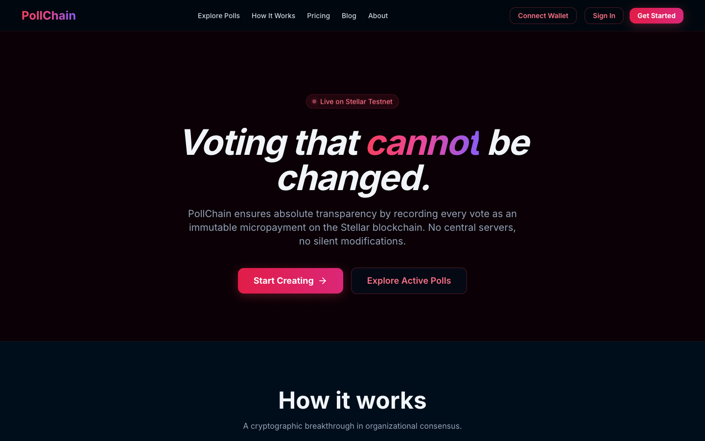
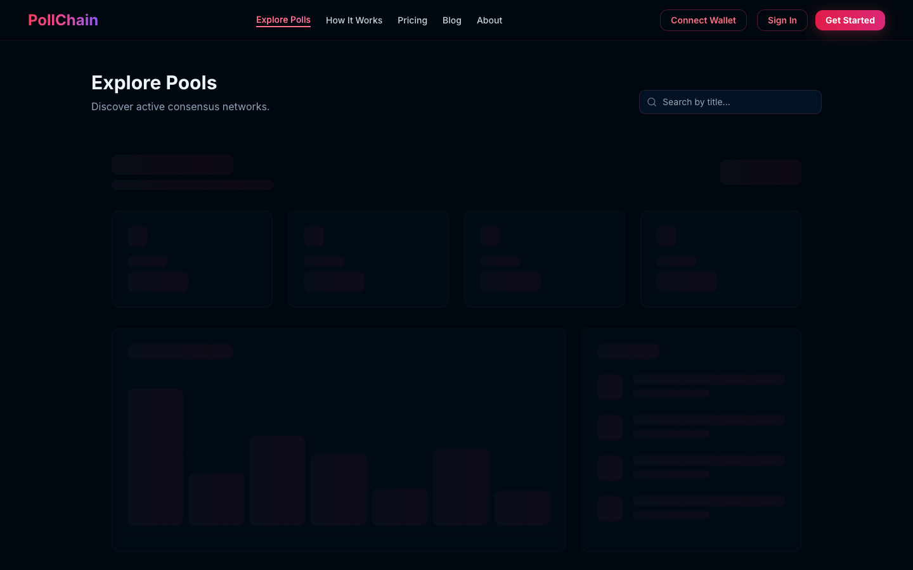
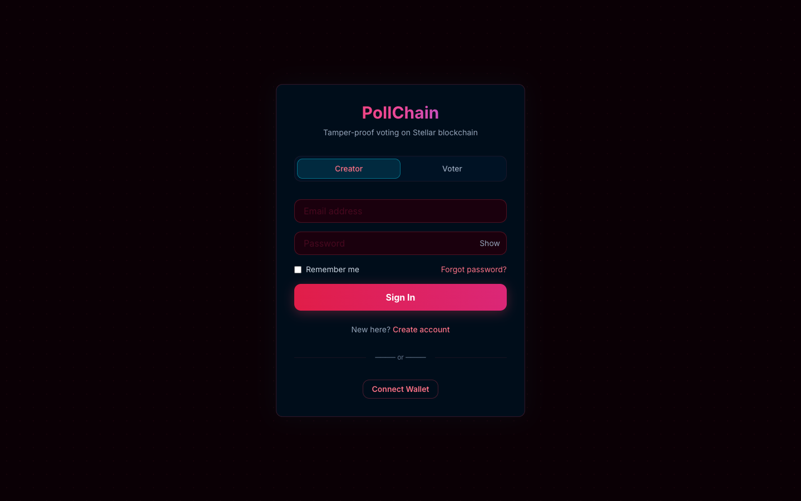
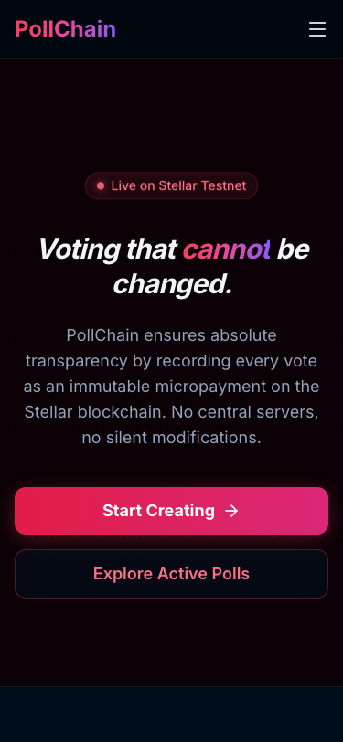
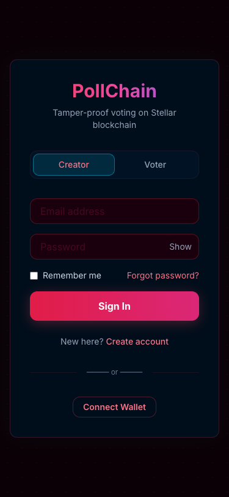
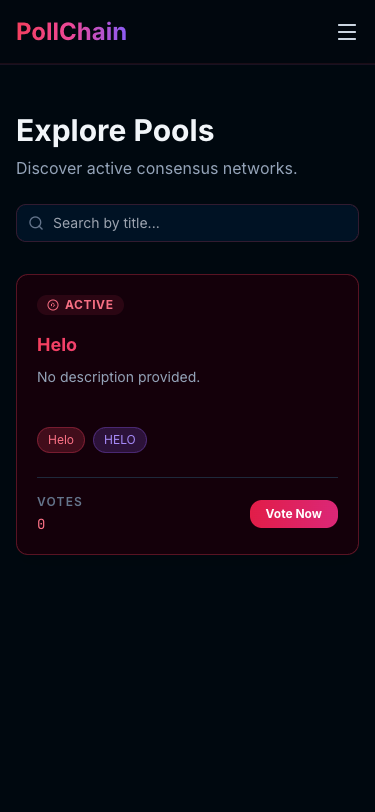

# PollChain — On-Chain Transparent Voting on Stellar


> **Tamper-proof, on-chain voting powered by the Stellar blockchain.**  
> Every vote is a real Stellar transaction — immutable, transparent, and publicly verifiable.

---

## 🌐 Live Demo

### **[https://poll-chain-phi.vercel.app](https://poll-chain-phi.vercel.app/)**

> Built on **Stellar Testnet** — no real funds are used. Fund your wallet via [Friendbot](https://friendbot.stellar.org).

---

## 📋 What It Does

PollChain is a decentralized voting platform where every vote is recorded as a real Stellar blockchain transaction. This eliminates concerns about election tampering and provides a public audit trail that anyone can independently verify through [Stellar Expert](https://stellar.expert/explorer/testnet).

### Key Features

- **On-Chain Voting** — Each vote is a real XLM microtransaction with the vote choice embedded as a Stellar memo
- **Transparent Results** — All votes are publicly verifiable on Stellar's Horizon API and block explorers
- **Creator Dashboard** — Create polls, manage options, publish to blockchain, and track results in real-time
- **Voter Dashboard** — Discover polls, cast votes via Freighter wallet, and view voting history
- **Wallet Integration** — Full Freighter wallet support: connect, view balance, send XLM, fund via Friendbot
- **Per-Poll Collector Wallets** — Each poll gets a unique Stellar keypair; votes are transactions to that wallet
- **Role-Based Auth** — Separate creator and voter flows with NextAuth.js JWT sessions
- **Real-Time Sync** — Sync vote tallies directly from Stellar Horizon to ensure accuracy
- **QR Code Sharing** — Generate QR codes for any poll for easy sharing
- **Mobile Responsive** — Fully responsive design from 375px to 4K

---

## 📸 Screenshots

### Desktop — Landing Page


### Desktop — Poll Explorer


### Desktop — Login


---

### 📱 Mobile Responsive Views (375px — iPhone SE)

<p align="center">
  
  &nbsp;&nbsp;
  
  &nbsp;&nbsp;
  
</p>

---

### 🔄 CI/CD Pipeline

Continuous Integration runs on every push via GitHub Actions:


Pipeline includes:
- ✅ TypeScript type checking
- ✅ ESLint code quality
- ✅ Production build verification
- ✅ Security scan (no hardcoded secrets)
- ✅ Testnet-only verification (no mainnet references)
- ✅ `.env.local` gitignore validation

Deployment is automated via **Vercel** — every push to `main` triggers a production deployment.

---

## ⚙️ Tech Stack

| Layer | Technology |
|-------|-----------|
| **Frontend** | Next.js 14 (App Router) + TypeScript + React 18 |
| **Styling** | TailwindCSS + shadcn/ui + Framer Motion |
| **Blockchain** | Stellar SDK v15 + Freighter Wallet v6 |
| **Database** | MongoDB Atlas (Mongoose ODM) |
| **Auth** | NextAuth.js (JWT strategy) |
| **Charts** | Recharts |
| **Deployment** | Vercel (auto-deploy from GitHub) |
| **CI/CD** | GitHub Actions |
| **Network** | Stellar Testnet |

---

## 🔗 Blockchain Details

| **Friendbot** | [https://friendbot.stellar.org](https://friendbot.stellar.org) |
| **PollStore ID** | `CC7E...VOTING` |
| **PollToken ID** | `CC7E...TOKEN` |

### How Voting Works (Soroban Integration)

1. **Token Eligibility** — Users must hold a **VOTE token** to participate. A "Claim" feature is available in the UI for testing.
2. **Poll Creation** — Polls are stored in the `PollStore` contract. Each poll has a title, options, and a real-time vote tally.
3. **Inter-contract Call** — When `vote` is called on the `PollStore`, it calls `balance_of` on the `PollToken` contract to verify eligibility.
4. **On-Chain Recording** — Votes are recorded directly in the contract's persistent storage, emitting a `vote` event for real-time tracking.

### How Voting Works On-Chain

1. **Poll Creation** — A new Stellar keypair (collector wallet) is generated per poll and funded via Friendbot
2. **Vote Casting** — Voters send a 0.0000001 XLM microtransaction to the collector wallet with the vote option encoded as a **Stellar Memo** field
3. **Vote Verification** — Anyone can verify votes by querying the collector wallet's transaction history on Horizon
4. **Result Tallying** — Results are computed by counting transactions grouped by memo value

### Asset / Token Details
| Property | Value |
|----------|-------|
| **Asset Code** | XLM (Native Lumens) |
| **Usage** | Microtransaction votes (0.0000001 XLM per vote) |
| **Explorer** | [XLM on Stellar Expert](https://stellar.expert/explorer/testnet/asset/XLM) |

> **Note:** PollChain uses native XLM for voting transactions. No custom tokens or liquidity pools are deployed. Each poll generates a unique **collector wallet address** that receives vote transactions — these can be queried via `https://horizon-testnet.stellar.org/accounts/{COLLECTOR_ADDRESS}/transactions`.

### Example Transaction Verification

To verify any vote on-chain:
```
https://horizon-testnet.stellar.org/transactions/{TX_HASH}
```

Or browse all votes for a specific poll:
```
https://stellar.expert/explorer/testnet/account/{COLLECTOR_WALLET}
```

---

## 🚀 Setup Instructions

### Prerequisites
- Node.js 18+
- MongoDB Atlas account ([free tier](https://cloud.mongodb.com))
- [Freighter wallet](https://freighter.app/) browser extension (set to **Testnet**)

### 1. Clone Repository
```bash
git clone https://github.com/Garvitk26/poll-chain.git
cd poll-chain
```

### 2. Install Dependencies
```bash
npm install
```

### 3. Configure Environment
```bash
cp .env.example .env.local
```

Edit `.env.local`:
```env
MONGODB_URI=mongodb+srv://your-connection-string
NEXTAUTH_SECRET=your-random-secret-key
NEXTAUTH_URL=http://localhost:3000
NEXT_PUBLIC_STELLAR_NETWORK=testnet
NEXT_PUBLIC_STELLAR_HORIZON=https://horizon-testnet.stellar.org
POLL_ENCRYPTION_KEY=your-64-char-hex-key
```

### 4. Set Up MongoDB Atlas
1. Visit [cloud.mongodb.com](https://cloud.mongodb.com) and create a free M0 cluster
2. Add a database user and allow network access (`0.0.0.0/0`)
3. Copy the connection string into `MONGODB_URI`

### 5. Set Up Freighter Wallet
1. Install [Freighter](https://freighter.app/) and switch to **Testnet**
2. Fund your wallet: `https://friendbot.stellar.org/?addr=YOUR_PUBLIC_KEY`

### 6. Run Development Server
```bash
npm run dev
```
Visit [http://localhost:3000](http://localhost:3000)

### 7. Test the Full Flow
1. **Sign up** at `/signup` (choose Creator or Voter role)
2. **Log in** at `/login`
3. **Connect wallet** — click "Synchronize Identity" and approve in Freighter
4. **Create a poll** (Creator) — add title, options, and publish
5. **Cast a vote** (Voter) — browse polls, select an option, approve the Stellar transaction in Freighter
6. **Verify on-chain** — click the transaction hash to view it on Stellar Expert

---

## 📁 Project Structure

```
pollchain/
├── app/                          # Next.js 14 App Router
│   ├── (auth)/                   # Auth pages (login, signup)
│   ├── api/                      # API routes
│   │   ├── auth/[...nextauth]/   # NextAuth handler
│   │   ├── polls/                # Poll CRUD + voting
│   │   ├── user/                 # Profile & wallet linking
│   │   ├── verify/               # TX verification
│   │   └── wallet/               # Balance & send XLM
│   ├── creator/                  # Creator dashboard & pages
│   ├── voter/                    # Voter dashboard & pages
│   ├── poll/                     # Public poll pages
│   ├── results/                  # Results visualization
│   └── verify/                   # Transaction verifier
├── components/
│   ├── shared/                   # Reusable components (WalletManager, PollCard, etc.)
│   └── ui/                       # shadcn/ui primitives
├── lib/
│   ├── auth.ts                   # NextAuth configuration
│   ├── stellar.ts                # Stellar SDK client (browser-safe)
│   ├── stellar-server.ts         # Server-only crypto operations
│   ├── db.ts                     # MongoDB connection
│   ├── models/                   # Mongoose schemas
│   └── context/                  # React contexts
├── .github/workflows/ci.yml     # GitHub Actions CI pipeline
├── middleware.ts                 # Auth & role-based routing
└── types/next-auth.d.ts         # TypeScript augmentations
```

---

## 🔒 Security

- **Client-side signing** — Private keys never leave the Freighter extension
- **Encrypted collector secrets** — Poll keypair secrets are AES-256-GCM encrypted server-side
- **No mainnet exposure** — CI pipeline checks for mainnet references and blocks them
- **Rate limiting** — Account lockout after 5 failed login attempts (15-minute cooldown)
- **Session management** — JWT tokens with configurable expiry + inactivity timeout
- **Gitignored secrets** — `.env.local` verified in CI as gitignored

---

## 🌱 Deployment

### Vercel (Production)
1. Push to GitHub
2. Import to [Vercel](https://vercel.com) and connect the repository
3. Add environment variables in Vercel dashboard:
   - `MONGODB_URI`
   - `NEXTAUTH_SECRET`
   - `NEXTAUTH_URL` → your Vercel deployment URL
   - `POLL_ENCRYPTION_KEY`
4. Every push to `main` auto-deploys

### CI/CD
GitHub Actions runs on every push to `main`:
- TypeScript type check
- ESLint linting
- Production build
- Security scan

---

## 📝 Commit History

This project has **39+ meaningful commits** following conventional commit format, including:

- `feat:` — Feature implementations (on-chain voting, wallet integration, dashboard)
- `fix:` — Bug fixes (Stellar SDK v15 migration, auth flow, Freighter v6 API)  
- `chore:` — Maintenance (CI setup, dependency management, deployment config)
- `docs:` — Documentation updates

---

## 🏆 Hackathon

Built for the **Rise In Stellar Blockchain Program** using the Stellar Testnet.

### Submission Checklist
- [x] Public GitHub repository
- [x] README with complete documentation
- [x] 39+ meaningful commits
- [x] Live demo: [poll-chain-phi.vercel.app](https://poll-chain-phi.vercel.app/)
- [x] Mobile responsive screenshots (375px)
- [x] CI/CD pipeline badge (GitHub Actions)
- [x] Blockchain: Stellar Testnet (Soroban Smart Contracts)
- [x] Inter-contract calls: `PollStore` → `PollToken`
- [x] Custom Token: `VOTE` token deployed
- [x] Transaction verification via Horizon API & Stellar Expert
- [x] CI/CD: GitHub Actions (Contract Build & Project Sync)

---

## 📄 License

MIT — see [LICENSE](./LICENSE)
