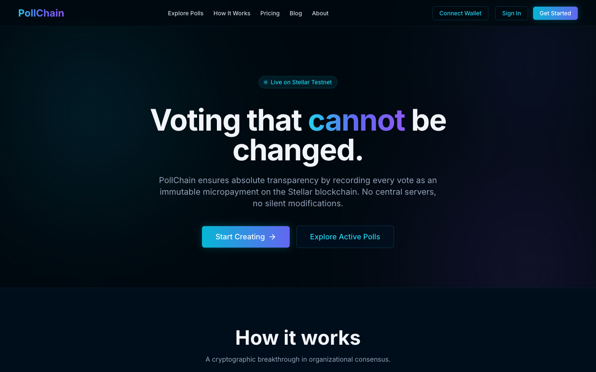
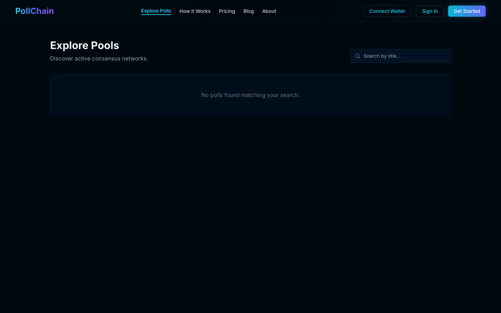
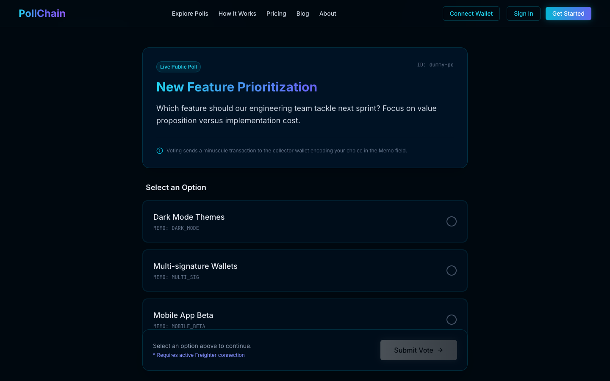
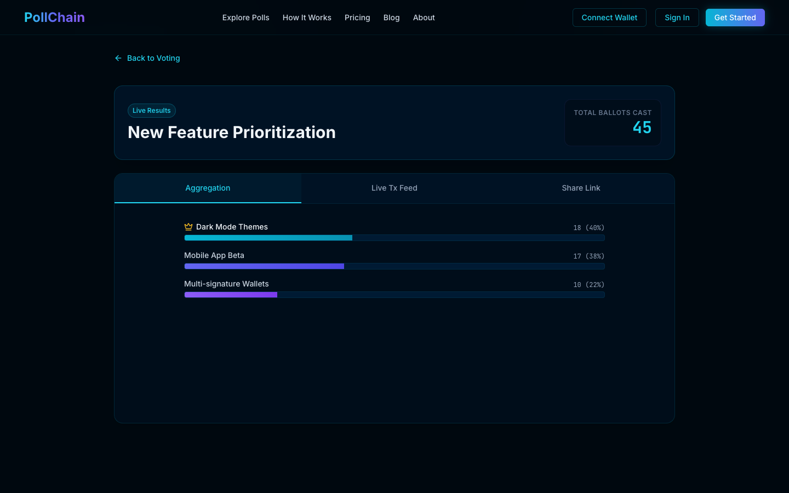
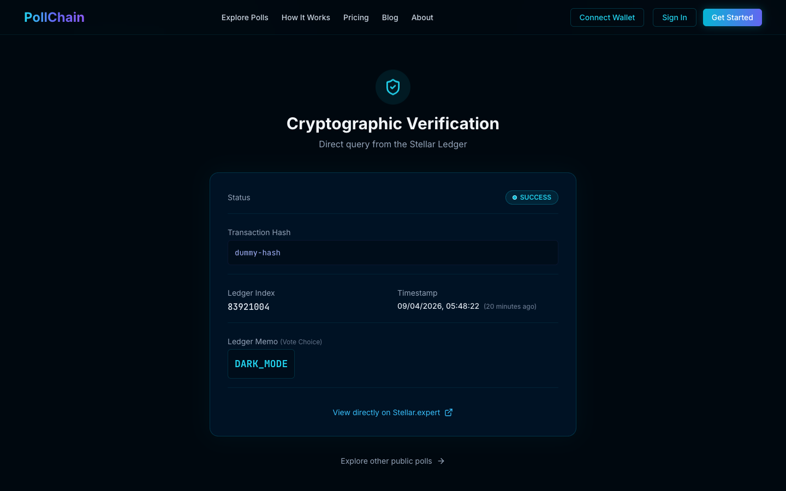

<div align="center">
  
  <h1>PollChain 🗳️⚡</h1>
  <p><strong>Immutable. Cryptographic. Decentralized Consensus.</strong></p>
  <br />
</div>

<p align="center">
  
</p>

## Introduction
PollChain completely revolutionizes organizational and public consensus gathering by eliminating backend trust dependencies. Unlike blackbox proprietary databases which can silently manipulate ballots, PollChain forces every single vote natively onto the **Stellar Blockchain Network**. 

Votes are encoded directly into the transparent Transaction `memo` properties leveraging micro-payments ($0.00001 fees) bridging web users securely into the ledger via [Freighter](https://www.freighter.app/).

---

## 🔥 Features

- ⚡️ **Millisecond Finality**: Leveraging Stellar network limits to approve and permanently record bulk-scale votes within ~5 seconds universally.
- 🔐 **Cryptographic Guarantee**: Absolute public transparency. Scan transactions directly from official Horizon nodes. 
- 🌌 **"Cyan Electric" UX Design**: Immersive interactive flows, glassmorphism aesthetics, simulated connection phases, and custom reactive CSS analytics charting.
- 💼 **Next.js 14 Framework Edge**: Built natively on App Router, serverless mongoose tracking caching, standard NextAuth security matrices.

<br/>

<div align="center">
  
  
</div>

<br/>

---

## 🏗️ Technical Architecture
### Roles
- **Voter**: Connects local `Freighter` wallet extensions. Signs payloads strictly authorizing micro-fees routing distinct choice markers onto network collectors.
- **Creator**: Provisions active networks. Spawns automated isolated Keypair collectors mapped explicitly via Node cryptographically `AES-256-CBC` blinded secrets.

### Flow Dynamics
1. Initialize Web3 Wallet Native hooks via component libraries.
2. Select desired option inside UI. Front-end formats specific memo string (max 28 Bytes). 
3. User signs generated native `<TransactionBuilder>`. Overrides zero logic natively broadcasting out to Horizon endpoints directly. 
4. Confirm ledger index inclusions routing uniquely to Verifiable API logic gates checking duplication signatures across Mongoose blocks. 

<br/>

<div align="center">
  
  
</div>

<br/>

---

## 🏁 Getting Started
Deploy the application locally to test the complete flow. 
```bash
# Clone the repository
git clone https://github.com/pollchain/core
cd pollchain

# Install packages
npm install

# Configure environments (.env.local)
# Requires MONGODB_URI, NEXTAUTH_SECRET, NEXTAUTH_URL, POLL_ENCRYPTION_KEY, NEXT_PUBLIC_STELLAR_HORIZON
cp .env.example .env.local

# Run development server
npm run dev
```

Navigate to `http://localhost:3000` to interact. 

<br>
<p align="center">Built natively alongside Stellar Consensus Protocols.</p>
# pollchain
# pollchain
